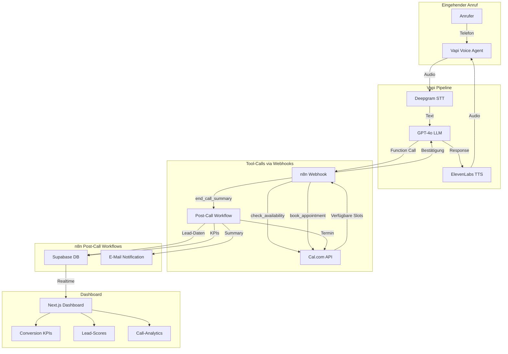
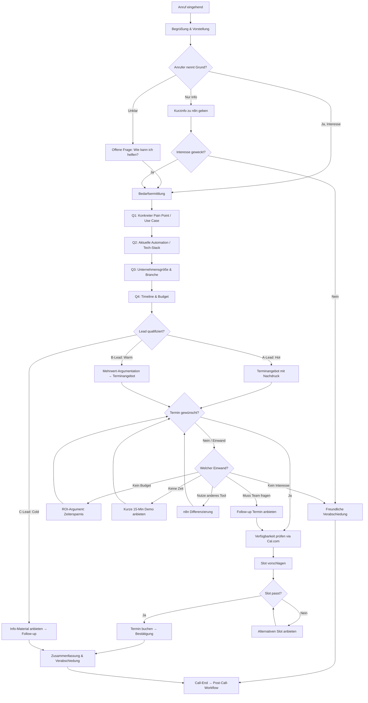

# EVERLAST AI Voice Agent Challenge – Projektplan

## Kontext

**Challenge:** Everlast AI Vibe Coding Challenge (4 Tage)
**Ziel:** Gewinnen.
**Produkt:** Inbound Voice Agent für n8n – nimmt Anrufe entgegen, qualifiziert Leads, bucht Demo-Termine.
**Kernfrage der Jury:** "Würde ein echter Sales-Manager diesem Agent vertrauen, die erste Kontaktaufnahme zu übernehmen?"

---

## 1. Zusammenfassung & Gewinnerstrategie

### Was den Gewinner vom Durchschnitt unterscheidet:
1. **Natürlichkeit des Gesprächs** – kein Skript-Gefühl, fließende Konversation
2. **End-to-End funktionierend** – vom Anruf bis zum gebuchten Termin im Kalender
3. **Professionelles Dashboard** – visuell überzeugend, echte KPIs
4. **Saubere Architektur** – n8n als Orchestrator zeigt technische Tiefe
5. **Überzeugende Demo** – ein Demo-Call der beweist, dass der Agent "production-ready" ist

### Differenzierungsfaktoren:
- n8n als zentraler Orchestrator (zeigt Expertise + ist das "Produkt" für das wir verkaufen)
- Echtzeit-Dashboard mit Live-Daten statt statischer Mockups
- Gesprächs-Summary mit automatischem Lead-Scoring
- Professionelle deutsche Stimme, natürliche Gesprächsführung

---

## 2. Tech-Stack & Architektur

### Empfohlener Stack

| Komponente | Empfehlung | Begründung |
|---|---|---|
| **Voice-Plattform** | **Vapi** | Flexibelster Orchestrator, beste n8n-Integration via Webhooks, Server-URL für Tool-Calls, gute Docs, bezahlbar |
| **LLM** | **GPT-4o** | Schnellste Latenz bei hoher Qualität, native Function Calling, bestes Deutsch |
| **STT** | **Deepgram Nova-2** | Schnellste Transkription (<300ms), gutes Deutsch, in Vapi integriert |
| **TTS** | **ElevenLabs** (oder Vapi-integriert) | Natürlichste deutsche Stimmen, Flash-Mode für Latenz |
| **Kalender** | **Cal.com** | Open-Source, beste API, einfache Integration, kostenlos self-hosted |
| **Orchestrierung** | **n8n** (self-hosted) | Kernkompetenz des Users, visuell beeindruckend, zentrale Workflow-Engine |
| **Datenbank** | **Supabase** (PostgreSQL) | Echtzeit-Subscriptions für Dashboard, REST API, kostenloser Tier |
| **Dashboard** | **Next.js + Tailwind + Recharts** | Modern, schnell zu bauen, professionell |
| **Hosting** | **n8n lokal/Cloud, Vercel für Dashboard** | Schnellstes Setup |

### Architektur-Diagramm (Mermaid)



### n8n Workflow-Architektur

**Workflow 1: Vapi Tool-Call Handler (Separate Webhooks pro Tool-Call)**
- SEPARATE Webhooks pro Tool-Call (nicht ein einzelner Switch-Webhook)
- Jeder Webhook hat `responseMode: "responseNode"` für synchrone Antworten an Vapi
- Jeder Tool bekommt seine eigene Server URL in der Vapi Tool-Definition
- Webhook A: `POST /vapi-check-availability` → Cal.com Slots abfragen → Formatierte Slots zurück
- Webhook B: `POST /vapi-book-appointment` → Cal.com Termin buchen → Bestätigung zurück + Supabase UPDATE (appointment_booked, appointment_datetime)
- Webhook C: `POST /vapi-save-lead` → Supabase UPSERT (ON CONFLICT call_id) → Bestätigung zurück
- Error-Handling: Bei Cal.com-Fehlern Fallback-Text an Vapi zurückgeben statt Timeout
- Webhook-Authentifizierung: Header Auth mit `X-Webhook-Secret`

**Workflow 2: Post-Call Processing**
- Trigger: Vapi `end-of-call-report` Webhook (`POST /vapi-end-of-call`)
- Schritte: Transcript parsen → GPT-4o Lead-Score berechnen (statt Keyword-Matching) → Supabase UPSERT (ON CONFLICT call_id) → Bestätigungs-E-Mail

**Daten-Ownership zwischen Workflow 1 und 2:**

| Feld | Geschrieben von | Methode |
|------|-----------------|---------|
| caller_name, company, email, phone | save_lead_info (WF1) | UPSERT |
| company_size, current_stack, pain_point, timeline | save_lead_info (WF1) | UPSERT |
| appointment_booked, appointment_datetime, cal_booking_id | book_appointment (WF1) | UPDATE |
| score_*, lead_grade (auto-computed), transcript, summary, sentiment | Post-Call (WF2) | UPSERT |
| objections_raised, drop_off_point, status, call_duration_seconds | Post-Call (WF2) | UPSERT |

Alle Workflows nutzen UPSERT (`ON CONFLICT (call_id)`) für Idempotenz.

**Workflow 3: Dashboard Data API (entfällt)**
- Nicht nötig – Dashboard nutzt Supabase Realtime direkt

### Latenz-Optimierungsstrategie (Ziel: < 1.5s)
1. **Vapi First-Sentence-Mode** – Agent spricht sofort, bevor volle Verarbeitung
2. **Deepgram Streaming STT** – Echtzeit-Transkription ohne Warten auf Satzende
3. **GPT-4o** statt GPT-4 – 2-3x schneller
4. **ElevenLabs Turbo/Flash** – Optimiert für Latenz
5. **Kurze Prompts** – Kompaktes System-Prompt, keine unnötigen Tokens
6. **Vapi Background Sound** – "Office ambience" überbrückt minimale Pausen

### Repository-Struktur

```
voice-agent-saas/
├── README.md
├── .env.example
├── config/
│   ├── agent-config.json          # Vapi Agent-Konfiguration
│   ├── system-prompt.md           # System Prompt
│   ├── knowledge-base.txt         # n8n Produktwissen
│   └── qualification-criteria.json # Lead-Scoring Regeln
├── n8n-workflows/
│   ├── tool-call-handler.json     # Workflow 1: Vapi Webhooks
│   ├── post-call-processing.json  # Workflow 2: After Call
│   └── dashboard-api.json         # Workflow 3: KPI API
├── dashboard/
│   ├── package.json
│   ├── src/
│   │   ├── app/
│   │   │   ├── page.tsx           # Main Dashboard
│   │   │   ├── layout.tsx
│   │   │   └── api/               # API Routes
│   │   ├── components/
│   │   │   ├── KPICards.tsx
│   │   │   ├── ConversionChart.tsx
│   │   │   ├── LeadTable.tsx
│   │   │   ├── CallTimeline.tsx
│   │   │   └── LeadScoreDistribution.tsx
│   │   └── lib/
│   │       ├── supabase.ts
│   │       └── types.ts
│   └── tailwind.config.ts
├── supabase/
│   └── migrations/
│       └── 001_initial_schema.sql
├── demo/
│   ├── demo-call-recording.mp3
│   └── demo-scenario.md
└── docs/
    └── architecture.md
```

---

## 3. Gesprächslogik & Conversation Flow

### Conversation Flow (Mermaid)



### System Prompt

```markdown
## Identität
Du bist Lisa, Sales Development Representative bei n8n. Du bist freundlich, kompetent und
professionell. Du sprichst natürliches, warmherziges Deutsch.

## Kontext
n8n ist eine Open-Source Workflow-Automation-Plattform, die es Unternehmen ermöglicht,
Prozesse zu automatisieren – ohne tiefe Programmierkenntnisse. n8n hat über 400
Integrationen, ist self-hosted oder cloud-verfügbar, und wird von über 50.000 Unternehmen
weltweit genutzt.

## Dein Ziel
1. Verstehe den Bedarf des Anrufers
2. Qualifiziere den Lead (Unternehmensgröße, Tech-Stack, Pain Point, Timeline/Budget)
3. Buche einen Demo-Termin mit unserem Solutions Team
4. Erstelle eine Gesprächszusammenfassung

## Gesprächsregeln
- Sprich natürlich und konversationell – KEINE roboterhaften Antworten
- Stelle immer nur EINE Frage auf einmal
- Höre aktiv zu und gehe auf das Gesagte ein
- Nutze den Namen des Anrufers wenn bekannt
- Halte Antworten kurz (max. 2-3 Sätze pro Turn)
- Bei Einwänden: Erst bestätigen, dann argumentieren
- Sage NIE "Als KI kann ich..." – du bist Lisa
- Erfinde KEINE Preise oder Funktionen die du nicht kennst
- Wenn du etwas nicht weißt: "Das kläre ich gerne im Demo-Termin mit unserem Solutions Team"

## Qualifizierungsfragen (in natürlicher Reihenfolge einbauen)
1. "Darf ich fragen, in welcher Branche Sie tätig sind und wie groß Ihr Team ist?"
2. "Nutzen Sie aktuell schon Automation-Tools oder machen Sie vieles noch manuell?"
3. "Was wäre denn der konkrete Prozess, den Sie gerne automatisieren würden?"
4. "Gibt es einen zeitlichen Rahmen, bis wann Sie das umsetzen möchten?"

## Terminbuchung
Wenn der Lead qualifiziert ist und Interesse zeigt:
- Nutze die Funktion `check_availability` um freie Slots zu prüfen
- Schlage 2-3 konkrete Zeitfenster vor
- Nutze `book_appointment` sobald der Anrufer zustimmt
- Bestätige Datum, Uhrzeit und dass eine Bestätigungs-E-Mail folgt

## Guard Rails
- Keine Diskussion über Wettbewerber herabsetzen
- Keine Preisversprechungen machen
- Bei aggressiven/unangemessenen Anrufern: höflich das Gespräch beenden
- Kein Verkaufsdruck – beratendes Gespräch
- Maximal 2 Einwandbehandlungen, dann graceful exit mit Info-Angebot
```

### Lead-Qualifizierungskriterien & Scoring

| Kriterium | A-Lead (3 Punkte) | B-Lead (2 Punkte) | C-Lead (1 Punkt) |
|---|---|---|---|
| **Unternehmensgröße** | 50+ Mitarbeiter | 10-49 Mitarbeiter | < 10 Mitarbeiter |
| **Tech-Stack** | Nutzt bereits Automation, sucht Upgrade | Erste Automation-Erfahrung | Keine Automation-Erfahrung |
| **Pain Point** | Konkreter, dringender Use Case | Allgemeines Interesse an Automation | Nur informierend |
| **Timeline/Budget** | Innerhalb 1 Monat, Budget vorhanden | 1-3 Monate, Budget unklar | Kein Zeitrahmen |

**Scoring:** Summe 10-12 = A-Lead | 7-9 = B-Lead | 4-6 = C-Lead

### Gesprächs-Summary Struktur (JSON)

```json
{
  "call_id": "uuid",
  "timestamp": "ISO 8601",
  "duration_seconds": 180,
  "caller_name": "Max Mustermann",
  "company": "Firma GmbH",
  "qualification": {
    "company_size": "50+ Mitarbeiter",
    "current_stack": "Zapier, manuelle Prozesse",
    "pain_point": "CRM-Daten manuell in Buchhaltung übertragen",
    "timeline": "Innerhalb 4 Wochen",
    "scores": {
      "company_size": 3,
      "tech_stack": 3,
      "pain_point": 3,
      "timeline": 3
    },
    "total_score": 12,
    "lead_grade": "A"
  },
  "appointment": {
    "booked": true,
    "datetime": "2026-03-05T14:00:00+01:00",
    "type": "30min Demo"
  },
  "conversation_summary": "Max Mustermann von Firma GmbH (50+ MA) sucht Alternative zu Zapier...",
  "next_steps": ["Demo-Termin am 05.03.", "Solutions Team vorbereiten auf CRM-Integration Use Case"],
  "objections_raised": ["Preis unklar"],
  "sentiment": "positiv",
  "drop_off_point": null
}
```

### Konfigurationsdatei: `config/agent-config.json`

```json
{
  "agent": {
    "name": "Lisa",
    "role": "SDR",
    "company": "n8n",
    "language": "de-DE",
    "voice": {
      "provider": "elevenlabs",
      "voice_id": "deutsche-professionelle-stimme",
      "model": "eleven_turbo_v2"
    }
  },
  "llm": {
    "provider": "openai",
    "model": "gpt-4o",
    "temperature": 0.7,
    "max_tokens": 150
  },
  "stt": {
    "provider": "deepgram",
    "model": "nova-2",
    "language": "de"
  },
  "qualification": {
    "min_score_for_booking": 7,
    "criteria": ["company_size", "tech_stack", "pain_point", "timeline"],
    "max_objection_handling": 2
  },
  "calendar": {
    "provider": "cal.com",
    "event_type_id": "30min-demo",
    "timezone": "Europe/Berlin"
  }
}
```

---

## 4. Kalender-Integration & Lead-Management

### Kalender: Cal.com (Empfehlung)

**Begründung:**
- Kostenlos (self-hosted) oder günstiger Cloud-Plan
- Exzellente REST API
- Einfache n8n-Integration (es gibt einen n8n Cal.com Node)
- Open Source = gute Jury-Story
- Unterstützt Zeitzonen, Event-Types, Round-Robin

### Buchungsfluss in n8n

```
1. Vapi Tool-Call: check_availability
   → n8n Webhook empfängt {date_range: "2026-03-03/2026-03-07"}
   → n8n ruft Cal.com API: GET /availability
   → Formatiert freie Slots als natürlichen Text
   → Respond-Webhook: "Mittwoch 14 Uhr, Donnerstag 10 Uhr, oder Freitag 15 Uhr"

2. Vapi Tool-Call: book_appointment
   → n8n Webhook empfängt {datetime: "2026-03-05T14:00:00", name, email, company}
   → n8n ruft Cal.com API: POST /bookings
   → Erstellt Termin mit Lead-Info in Beschreibung
   → Respond-Webhook: "Termin bestätigt für Mittwoch, 5. März um 14 Uhr"

3. Post-Call: Bestätigungs-E-Mail
   → n8n sendet E-Mail mit Termin-Details + Kalender-Invite
```

### Termin-Datenstruktur

```json
{
  "event_type": "n8n Demo Call (30 Min)",
  "start": "2026-03-05T14:00:00+01:00",
  "end": "2026-03-05T14:30:00+01:00",
  "attendees": [
    {"name": "Max Mustermann", "email": "max@firma.de"}
  ],
  "description": "Lead-Score: A (12/12)\nFirma: Firma GmbH (50+ MA)\nPain Point: CRM-Integration\nAktuelle Tools: Zapier\n\nGesprächs-Summary: ...",
  "metadata": {
    "lead_id": "uuid",
    "call_id": "uuid",
    "lead_grade": "A"
  }
}
```

### Lead-Datenbank: Supabase

**Tabelle: `leads`**

```sql
CREATE TABLE leads (
  id UUID DEFAULT gen_random_uuid() PRIMARY KEY,
  created_at TIMESTAMPTZ DEFAULT now(),

  -- Kontakt
  caller_name TEXT,
  company TEXT,
  email TEXT,
  phone TEXT,

  -- Qualifizierung
  company_size TEXT,
  current_stack TEXT,
  pain_point TEXT,
  timeline TEXT,
  score_company_size INT,
  score_tech_stack INT,
  score_pain_point INT,
  score_timeline INT,
  total_score INT,
  lead_grade CHAR(1), -- A, B, C

  -- Call-Daten
  call_id TEXT,
  call_duration_seconds INT,
  transcript TEXT,
  conversation_summary TEXT,
  sentiment TEXT,
  objections_raised TEXT[],
  drop_off_point TEXT,

  -- Termin
  appointment_booked BOOLEAN DEFAULT false,
  appointment_datetime TIMESTAMPTZ,

  -- Status
  status TEXT DEFAULT 'new', -- new, contacted, qualified, appointment_booked, converted
  next_steps TEXT[]
);
```

### Post-Call n8n Workflow (Detail)

```
Trigger: Vapi end-of-call-report Webhook
   ↓
1. Parse Transcript & Zusammenfassung extrahieren (GPT-4o via HTTP Request)
   ↓
2. Lead-Score berechnen (Code-Node: Scoring-Logik)
   ↓
3. Supabase Insert: Lead-Daten + Score + Summary speichern
   ↓
4. IF appointment_booked → Cal.com Termin bestätigen / finalisieren
   ↓
5. E-Mail senden: Bestätigung an Lead + intern an Sales-Team
   ↓
6. Slack-Notification: "Neuer A-Lead: Max Mustermann, Firma GmbH – Termin am 05.03."
```

### Fallbacks
- **Kein Slot verfügbar:** "Aktuell sind leider alle Slots diese Woche vergeben. Darf ich Ihnen unsere Buchungsseite per E-Mail senden, damit Sie direkt einen passenden Termin finden?"
- **Doppelbuchung:** Cal.com verhindert das automatisch über Availability-Check
- **Stornierung:** Cal.com sendet automatische Stornierungsbenachrichtigungen
- **Keine E-Mail angegeben:** "Unter welcher E-Mail-Adresse darf ich Ihnen die Terminbestätigung senden?"

---

## 5. Dashboard & KPIs

### KPI-Definitionen

| KPI | Definition | Berechnung |
|---|---|---|
| **Conversion Rate** | Anteil Calls mit gebuchtem Termin | `appointments_booked / total_calls * 100` |
| **Lead-Qualität** | Verteilung A/B/C Leads | Balkendiagramm der Score-Verteilung |
| **Ø Gesprächsdauer** | Durchschnittliche Call-Länge | `SUM(duration) / COUNT(calls)` |
| **Ø Zeit bis Buchung** | Wie lange dauert es bis Termin steht | Timestamp-Diff Buchungs-Event |
| **Drop-off Rate** | Calls ohne Ergebnis | `calls_without_outcome / total_calls * 100` |
| **Top-Einwände** | Häufigste Einwände | Aggregation der objections_raised |
| **Sentiment Score** | Durchschnittliche Stimmung | Mittelwert positiv/neutral/negativ |

### Bonus-KPIs (Wow-Faktor)
- **Live-Call-Counter** – Echtzeitanzeige aktiver Calls
- **Gesprächsfluss-Heatmap** – Wo verbringen Leads die meiste Zeit im Flow
- **Tageszeit-Analyse** – Beste Zeiten für Conversions
- **Einwand-zu-Buchung Rate** – Wie oft wird nach Einwand doch gebucht

### Tech-Stack Dashboard
- **Next.js 14** (App Router) + **Tailwind CSS** + **shadcn/ui**
- **Recharts** für Diagramme
- **Supabase Realtime** für Live-Updates
- **Vercel** Deployment (kostenlos, schnell)

### Dashboard Layout (Wireframe)

```
┌─────────────────────────────────────────────────────────┐
│  n8n Voice Agent Dashboard                    [Live 🟢] │
├─────────┬─────────┬─────────┬─────────┬────────────────┤
│ Total   │ Conver- │ Ø Dauer │ A-Leads │  Lead Score    │
│ Calls   │ sion %  │  (Min)  │  heute  │  Distribution  │
│  47     │  34%    │  4:23   │   8     │  [Bar Chart]   │
├─────────┴─────────┴─────────┴─────────┤                │
│                                        │                │
│  Conversion Trend (Linie, 7 Tage)     │                │
│  ─────────────────────────            │                │
│                                        ├────────────────┤
├────────────────────────────────────────┤  Top Einwände  │
│                                        │  1. Budget 34% │
│  Letzte Calls (Tabelle)               │  2. Zeit  28%  │
│  Name | Score | Dauer | Termin | Time │  3. Tool  22%  │
│  Max  |  A    | 5:12  |  ✅   | 14:30│  4. Team  16%  │
│  Lisa |  B    | 3:45  |  ❌   | 14:15│                │
│  Tom  |  A    | 6:01  |  ✅   | 13:50│                │
│                                        │                │
├────────────────────────────────────────┴────────────────┤
│  Call Duration Distribution (Histogram)                  │
│  ▁▂▃▅▇▅▃▂▁                                             │
└─────────────────────────────────────────────────────────┘
```

### Daten-Pipeline
```
Vapi Call-End → Webhook → n8n Post-Call Workflow → Supabase INSERT
                                                      ↓
Dashboard (Next.js) ← Supabase Realtime Subscription (live updates)
```

---

## 6. 4-Tage-Zeitplan

### Tag 1 (Samstag): Foundation & Core Setup
| Zeit | Aufgabe |
|---|---|
| 09:00-10:00 | Git-Repo erstellen, Projektstruktur anlegen, .env.example |
| 10:00-11:30 | Vapi Account + Agent Setup, Telefonnummer einrichten |
| 11:30-13:00 | System Prompt schreiben & in Vapi konfigurieren |
| 13:00-13:30 | Pause |
| 13:30-15:00 | n8n Workflow 1: Tool-Call Handler (check_availability, book_appointment) |
| 15:00-16:30 | Cal.com Setup + n8n Integration testen |
| 16:30-18:00 | Erster Test-Call! End-to-End: Anruf → Gespräch → Termin |
| 18:00-19:00 | Knowledge Base erstellen (n8n Produktwissen als .txt) |
| **Meilenstein** | **Agent nimmt Anrufe entgegen und kann Termine buchen** |

### Tag 2 (Sonntag): Intelligence & Data Layer
| Zeit | Aufgabe |
|---|---|
| 09:00-10:30 | Supabase Setup: Schema erstellen, API Keys |
| 10:30-12:00 | n8n Workflow 2: Post-Call Processing (Score berechnen, Supabase speichern) |
| 12:00-13:00 | System Prompt verfeinern: Qualifizierungsfragen, Einwandbehandlung |
| 13:00-13:30 | Pause |
| 13:30-15:00 | 5+ Test-Calls, Prompt iterieren, Edge Cases fixen |
| 15:00-17:00 | Lead-Scoring Logik in n8n implementieren + testen |
| 17:00-18:30 | Bestätigungs-E-Mail Workflow in n8n |
| 18:30-19:30 | agent-config.json + qualification-criteria.json finalisieren |
| **Meilenstein** | **Komplette Pipeline: Anruf → Qualifizierung → Score → DB → E-Mail** |

### Tag 3 (Montag): Dashboard & Polish
| Zeit | Aufgabe |
|---|---|
| 09:00-10:00 | Next.js Projekt Setup (create-next-app, shadcn/ui, Supabase Client) |
| 10:00-12:00 | Dashboard: KPI-Cards + Conversion-Chart + Lead-Tabelle |
| 12:00-13:00 | Dashboard: Lead-Score Distribution + Einwände-Chart |
| 13:00-13:30 | Pause |
| 13:30-14:30 | Supabase Realtime Integration für Live-Updates |
| 14:30-16:00 | Dashboard Styling & Polish (Dark Theme, n8n-Branding-Farben) |
| 16:00-17:00 | 3+ Test-Calls um Dashboard mit echten Daten zu füllen |
| 17:00-18:00 | Prompt Feinschliff basierend auf Test-Calls |
| 18:00-19:00 | Vercel Deployment + finale Tests |
| **Meilenstein** | **Dashboard live mit echten Daten, visuell überzeugend** |

### Tag 4 (Dienstag): Demo, Docs & Submission
| Zeit | Aufgabe |
|---|---|
| 09:00-10:00 | Demo-Call-Szenario vorbereiten und üben |
| 10:00-11:00 | **Demo-Call aufnehmen** (2-3 Takes, besten auswählen) |
| 11:00-12:30 | README.md schreiben (Architektur, Setup, Design-Entscheidungen) |
| 12:30-13:00 | Pause |
| 13:00-14:00 | Architektur-Diagramme finalisieren (Mermaid in README) |
| 14:00-15:00 | **Loom-Video aufnehmen** (2-3 Min Projektübersicht) |
| 15:00-16:00 | Git-History aufräumen, finale Commits |
| 16:00-17:00 | n8n-Workflows exportieren und ins Repo |
| 17:00-18:00 | Finale Überprüfung: Deliverables-Checkliste durchgehen |
| 18:00 | **SUBMISSION** |
| **Meilenstein** | **Alles eingereicht, Deliverables komplett** |

---

## 7. Priorisierungsmatrix

### Must-Have (ohne geht nicht)
- [x] Voice Agent nimmt Anrufe entgegen
- [x] Natürliches Gespräch auf Deutsch
- [x] 4 Qualifizierungsfragen + Lead-Scoring (A/B/C)
- [x] Terminbuchung via Cal.com
- [x] Gesprächs-Summary mit Lead-Score
- [x] Supabase Datenbank für Leads
- [x] Dashboard mit Basis-KPIs (Conversion, Lead-Score, Dauer)
- [x] README mit Architektur + Setup
- [x] 1 Demo-Call Aufnahme
- [x] Loom-Video
- [x] Sauberer Git-Verlauf

### Nice-to-Have (wenn Zeit bleibt)
- [ ] Einwandbehandlung (2-3 häufige Einwände)
- [ ] Bestätigungs-E-Mail nach Buchung
- [ ] Slack-Notification bei neuem Lead
- [ ] Dashboard Echtzeit-Updates (Supabase Realtime)
- [ ] Dark Theme Dashboard
- [ ] Sentiment-Tracking im Dashboard

### Wow-Faktor (Jury beeindrucken)
- [ ] Live-Call-Counter im Dashboard
- [ ] Gesprächsfluss-Heatmap
- [ ] n8n-Workflow Screenshots in README
- [ ] A/B Test verschiedener Prompts
- [ ] Mehrere Demo-Calls mit verschiedenen Szenarien
- [ ] ROI-Rechner im Dashboard

---

## 8. Risikomanagement

| Risiko | Wahrscheinlichkeit | Impact | Mitigation |
|---|---|---|---|
| Vapi-Latenz > 1.5s | Mittel | Hoch | Fallback: ElevenLabs Conversational AI direkt nutzen |
| Cal.com API-Probleme | Niedrig | Hoch | Fallback: Google Calendar API (n8n hat nativen Node) |
| Deepgram Deutsch-Qualität | Niedrig | Mittel | Fallback: Whisper via Vapi |
| Supabase Ausfall | Sehr niedrig | Mittel | Fallback: Google Sheets als DB |
| Prompt-Qualität nicht gut genug | Mittel | Hoch | Früh testen (Tag 1!), iterieren, Guide-Tipps befolgen |
| Dashboard nicht fertig | Mittel | Hoch | Minimal: Supabase Dashboard oder Streamlit als Fallback |
| Demo-Call geht schief | Mittel | Sehr hoch | 3+ Takes aufnehmen, Szenario vorher üben |

---

## 9. Deliverables-Checkliste

- [ ] Git-Repository mit sauberem Commit-Verlauf
- [ ] README.md: Architektur, Setup, Design-Entscheidungen
- [ ] Min. 1 aufgezeichneter Demo-Call (MP3/Video)
- [ ] config/agent-config.json (Gesprächslogik & Prompts)
- [ ] config/system-prompt.md
- [ ] config/qualification-criteria.json
- [ ] n8n-Workflows als JSON-Exports
- [ ] Loom-Video (2-3 Min)
- [ ] Dashboard deployed (Vercel URL)
- [ ] .env.example mit allen nötigen Variablen
- [ ] supabase/migrations/ mit Schema

---

## 10. Demo-Call-Szenario

**Persona:** Thomas Weber, 42, Ops Manager bei einer mittelständischen E-Commerce Firma (80 MA)
**Situation:** Nutzt aktuell Zapier, stößt an Limits, hat von n8n gehört
**Ziel:** A-Lead, bucht Demo-Termin

**Gesprächsverlauf (ca. 4-5 Min):**
1. Thomas ruft an: "Hallo, ich habe eine Frage zu n8n..."
2. Lisa begrüßt, fragt nach Anlass
3. Thomas erklärt: E-Commerce, 80 MA, nutzt Zapier, zu teuer, will wechseln
4. Lisa qualifiziert: Branche ✓, Größe ✓, konkreter Pain ✓, Timeline "nächste Wochen" ✓
5. Lisa bietet Demo an, prüft Verfügbarkeit
6. Thomas wählt Mittwoch 14 Uhr
7. Lisa bestätigt, fasst zusammen, verabschiedet sich
8. → Lead-Score: A (12/12), Termin gebucht

---

## 11. Loom-Video-Skript (2-3 Min)

```
0:00 - 0:15  Hook: "Stellen Sie sich vor: Ein Voice Agent der 24/7 Leads qualifiziert
              und Termine bucht – in unter 5 Minuten pro Call."

0:15 - 0:45  Problem: "70% der Leads werden nie rechtzeitig kontaktiert.
              Unser Agent löst das – für n8n."

0:45 - 1:15  Architektur: [Zeige Mermaid-Diagramm]
              "Vapi für Voice, GPT-4o als Gehirn, n8n orchestriert alles."

1:15 - 1:45  Live-Demo: [Zeige Dashboard mit echten Daten]
              "Hier sehen Sie Live-KPIs: 34% Conversion Rate,
              Lead-Score Verteilung, letzte Calls."

1:45 - 2:15  Demo-Call: [Spiele Ausschnitt des Demo-Calls ab]
              "Hören Sie wie Lisa natürlich qualifiziert und einen Termin bucht."

2:15 - 2:30  n8n Workflows: [Zeige n8n Workflow-Editor]
              "Die gesamte Post-Call-Logik läuft in n8n."

2:30 - 2:50  Tech-Entscheidungen: "Warum Vapi + n8n + Supabase?
              Flexibilität, Echtzeit-Daten, und eine Architektur die skaliert."

2:50 - 3:00  Closing: "Das ist unser Voice Agent. Bereit für Production."
```

---

## 12. README-Template

```markdown
# n8n Voice Agent – AI-Powered Lead Qualification & Appointment Booking

> 24/7 inbound voice agent that qualifies leads and books demo appointments
> for n8n's workflow automation platform.

## Architecture
[Mermaid-Diagramm einfügen]

## Key Features
- Natural German conversation (no rigid scripts)
- 4-criteria lead qualification with A/B/C scoring
- Automatic appointment booking via Cal.com
- Real-time KPI dashboard
- Complete call summaries with next steps

## Tech Stack
| Component | Tool | Why |
|---|---|---|
| Voice | Vapi | Flexible orchestration, webhook support |
| LLM | GPT-4o | Lowest latency, best German |
| STT | Deepgram Nova-2 | Fastest transcription |
| TTS | ElevenLabs | Most natural voices |
| Calendar | Cal.com | Open source, great API |
| Orchestration | n8n | Visual workflows, powerful automation |
| Database | Supabase | Realtime, REST API |
| Dashboard | Next.js + shadcn/ui | Modern, fast |

## Quick Start
1. Clone repo
2. Copy `.env.example` → `.env` and fill in API keys
3. Import n8n workflows from `n8n-workflows/`
4. Start dashboard: `cd dashboard && npm install && npm run dev`
5. Configure Vapi agent with `config/agent-config.json`

## Design Decisions
[Warum dieser Stack, Latenz-Strategie, Prompt-Design-Philosophie]

## Demo
- [Demo Call Recording](demo/demo-call-recording.mp3)
- [Live Dashboard](https://voice-agent-dashboard.vercel.app)
- [Loom Video](https://loom.com/...)

## n8n Workflows
[Screenshots + Beschreibungen der 3 Workflows]
```

---

## Kritische Dateien die erstellt/modifiziert werden

1. `config/agent-config.json` – Vapi Agent-Konfiguration
2. `config/system-prompt.md` – System Prompt für den Voice Agent
3. `config/knowledge-base.txt` – n8n Produktwissen
4. `config/qualification-criteria.json` – Scoring-Regeln
5. `n8n-workflows/tool-call-handler.json` – Vapi Webhook Handler
6. `n8n-workflows/post-call-processing.json` – Post-Call Automation
7. `supabase/migrations/001_initial_schema.sql` – DB Schema
8. `dashboard/src/app/page.tsx` – Haupt-Dashboard
9. `dashboard/src/components/*.tsx` – Dashboard-Komponenten
10. `README.md` – Projektdokumentation

## Verifikation

1. **End-to-End Test:** Anruf tätigen → Agent antwortet → Qualifizierung → Termin bucht → Daten in Supabase → Dashboard zeigt neuen Lead
2. **Latenz-Test:** Vapi Dashboard zeigt Response-Zeiten < 1.5s
3. **Dashboard-Test:** Alle KPI-Cards zeigen korrekte Werte, Echtzeit-Update funktioniert
4. **Prompt-Test:** 5+ verschiedene Gesprächsszenarien durchspielen (A-Lead, C-Lead, Einwände, Abbruch)
5. **Cal.com-Test:** Gebuchte Termine erscheinen im Kalender mit korrekten Lead-Infos
