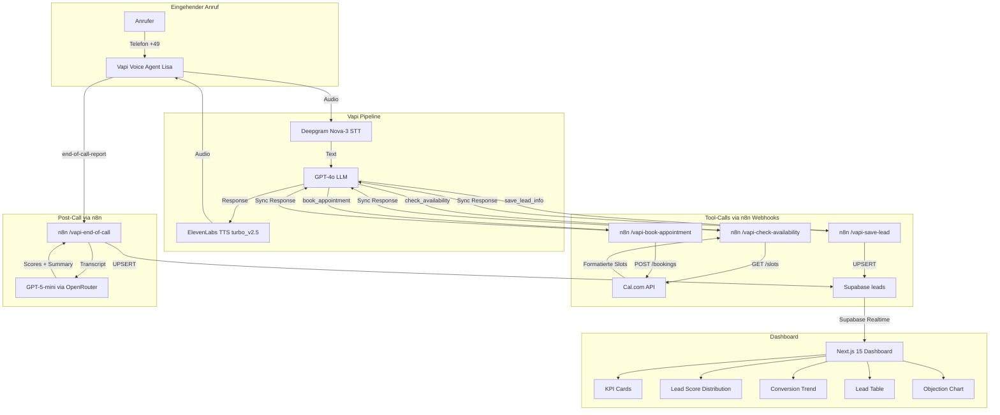
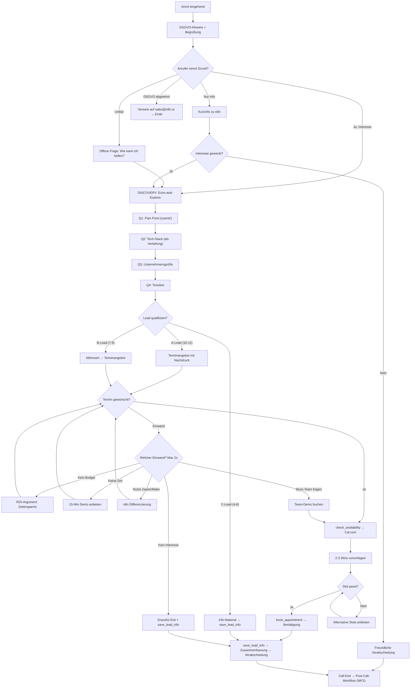

# EVERLAST AI Voice Agent Challenge – Projektplan

## Kontext

**Challenge:** Everlast AI Vibe Coding Challenge
**Ziel:** Gewinnen.
**Produkt:** Inbound Voice Agent "Lisa" für n8n – nimmt Anrufe entgegen, qualifiziert Leads, bucht Demo-Termine.
**Kernfrage der Jury:** "Würde ein echter Sales-Manager diesem Agent vertrauen, die erste Kontaktaufnahme zu übernehmen?"

---

## 1. Zusammenfassung & Gewinnerstrategie

### Was den Gewinner vom Durchschnitt unterscheidet:
1. **Natürlichkeit des Gesprächs** – kein Skript-Gefühl, fließende Konversation mit Echo-and-Explore Technik
2. **End-to-End funktionierend** – vom Anruf bis zum gebuchten Termin im Kalender, Daten in der DB
3. **Professionelles Dashboard** – Echtzeit-KPIs mit Supabase Realtime, keine statischen Mockups
4. **Saubere Architektur** – n8n als Orchestrator mit separaten Webhooks pro Tool-Call
5. **Überzeugende Demo** – ein Demo-Call der beweist, dass der Agent "production-ready" ist
6. **Robustes Error-Handling** – Fallback-Texte statt Crashes, UPSERT für Idempotenz

### Differenzierungsfaktoren:
- n8n als zentraler Orchestrator (zeigt Expertise + ist das "Produkt" für das wir verkaufen)
- Echtzeit-Dashboard mit Live-Daten via Supabase Realtime
- GPT-5-mini Lead-Scoring via OpenRouter (kein simples Keyword-Matching)
- Auto-berechneter Lead-Grade per DB-Trigger (total_score + lead_grade)
- Professionelle deutsche Stimme (ElevenLabs Turbo v2.5), natürliche Gesprächsführung
- DSGVO-konformer Aufzeichnungshinweis in der First Message
- Prompt-Injection Guard Rails im System Prompt

---

## 2. Tech-Stack & Architektur

### Finaler Stack

| Komponente | Tool | Version/Detail | Begründung |
|---|---|---|---|
| **Voice-Plattform** | **Vapi** | MCP-Zugriff | Flexibelster Orchestrator, per-Tool Server-URLs, End-of-Call Reports |
| **LLM (Voice)** | **GPT-4o** | via Vapi | Schnellste Latenz, natives Function Calling, bestes Deutsch |
| **LLM (Scoring)** | **GPT-5-mini** | via OpenRouter | Post-Call Analyse, JSON-Modus für strukturierte Scores |
| **STT** | **Deepgram Nova-3** | via Vapi | Schnellste Transkription (<300ms), gutes Deutsch |
| **TTS** | **ElevenLabs** | eleven_turbo_v2_5 | Natürlichste deutsche Stimmen, optimiert für Latenz |
| **Kalender** | **Cal.com** | REST API v1 | Open-Source, Event-Type-ID: `4897150` |
| **Orchestrierung** | **n8n** | v2.35.5 self-hosted | `https://n8n.srv1169417.hstgr.cloud` |
| **Datenbank** | **Supabase** | PostgreSQL 17 | Projekt: `ltarsnseyhtfbsxjrhdu` (eu-central-1) |
| **Dashboard** | **Next.js 15** + React 19 + Tailwind 4 + Recharts | App Router | 5 Visualisierungen, Supabase Realtime |
| **Hosting** | **Vercel** | Dashboard | Automatisches Deployment |

### Architektur-Diagramm



### n8n Workflow-Architektur

**Workflow 1: "Vapi Tool-Call Handler"**
- SEPARATE Webhooks pro Tool-Call (Pattern aus Template 3427 bestätigt)
- Jeder Webhook hat `responseMode: "responseNode"` für synchrone Antworten an Vapi
- Jeder Tool bekommt seine eigene Server URL in der Vapi Tool-Definition

| Webhook | Pfad | Funktion | Response |
|---------|------|----------|----------|
| A | `POST /vapi-check-availability` | Cal.com GET /v1/slots/available → Slots als dt. Text | Sync |
| B | `POST /vapi-book-appointment` | Cal.com POST /v1/bookings + Supabase UPDATE | Sync |
| C | `POST /vapi-save-lead` | Supabase UPSERT (ON CONFLICT call_id) | Sync |

Node-Graph pro Webhook:
```
[Webhook v2 (responseMode: responseNode)]
    → [Code: Extract & Validate Vapi Payload]
    → [HTTP Request / Supabase]
    → [Code: Format Response]
    → [Respond to Webhook]
    → (Error) [Set: Fallback-Text] → [Respond to Webhook: Error]
```

**Workflow 2: "Post-Call Processing"**
- Trigger: Vapi `end-of-call-report` Webhook (`POST /vapi-end-of-call`)
- `responseMode: "onReceived"` (fire-and-forget, Vapi wartet nicht)

```
[Webhook] → [Code: Extract Transcript & Metadata]
    → [If: Has Transcript?]
        → (true) [HTTP: GPT-5-mini via OpenRouter (JSON-Mode)] → [Code: Parse Scores]
        → (false) [Code: Minimal Record]
    → [HTTP: Supabase UPSERT]
```

**Vapi Wire-Format (Tool-Calls):**

Vapi sendet an n8n:
```json
{
  "message": {
    "type": "tool-calls",
    "call": { "id": "call-uuid" },
    "toolCallList": [{
      "id": "toolcall-uuid",
      "type": "function",
      "function": {
        "name": "check_availability",
        "arguments": { "date_range": "nächste Woche" }
      }
    }]
  }
}
```

n8n antwortet synchron:
```json
{
  "results": [{
    "toolCallId": "toolcall-uuid",
    "result": "Ich habe folgende Termine gefunden: Mittwoch 14 Uhr, Donnerstag 10 Uhr"
  }]
}
```

**Daten-Ownership zwischen Workflow 1 und 2:**

| Feld | Geschrieben von | Methode |
|------|-----------------|---------|
| caller_name, company, email, phone | save_lead_info (WF1) | UPSERT (ON CONFLICT call_id) |
| company_size, current_stack, pain_point, timeline | save_lead_info (WF1) | UPSERT |
| appointment_booked, appointment_datetime, cal_booking_id | book_appointment (WF1) | UPDATE WHERE call_id |
| score_*, transcript, conversation_summary, sentiment | Post-Call (WF2) | UPSERT |
| objections_raised, drop_off_point, status, call_duration_seconds | Post-Call (WF2) | UPSERT |
| lead_grade | **Auto-computed by DB Trigger** | Nicht manuell setzen! |
| total_score | **GENERATED ALWAYS Spalte** | Summe der 4 Einzelscores |

### Latenz-Optimierungsstrategie (Ziel: < 1.5s)
1. **Deepgram Nova-3** – Schnellste STT (<300ms), nativ in Vapi
2. **GPT-4o** für Voice – 2-3x schneller als GPT-4, natives Function Calling
3. **ElevenLabs Turbo v2.5** – Optimiert für Latenz, multilingual
4. **Kompakter System Prompt** – 182 Zeilen, max 20-25 Wörter pro Turn
5. **Background Sound "office"** – Überbrückt minimale Pausen natürlich
6. **Response Delay 0.4s** – Verhindert Unterbrechungen bei kurzen Pausen
7. **Post-Call fire-and-forget** – End-of-call Webhook braucht keine synchrone Antwort

### Repository-Struktur (Ist-Stand)

```
voice-agent-saas/
├── PROJEKTPLAN.md                    # Dieser Plan
├── CLAUDE.md                         # Agent-Team Kontext & Regeln
├── README.md                         # Projektdokumentation
├── .env.example                      # Template für Umgebungsvariablen
├── .agent-state.json                 # Shared Credentials zwischen Teammates
├── .mcp.json                         # MCP-Server Konfiguration (n8n, Vapi, Supabase)
├── config/
│   ├── agent-config.json             # Vapi Agent-Konfiguration (Voice, LLM, STT)
│   ├── system-prompt.md              # System Prompt für Lisa (182 Zeilen)
│   ├── knowledge-base.txt            # n8n Produktwissen (400 Integrationen, Pricing)
│   └── qualification-criteria.json   # Lead-Scoring Matrix mit Keyword-Indikatoren
├── n8n-workflows/
│   ├── README.md                     # Beschreibung der Workflows
│   ├── tool-call-handler.json        # WF1: Vapi Webhook Handler (zu erstellen)
│   └── post-call-processing.json     # WF2: After-Call Scoring (zu erstellen)
├── dashboard/
│   ├── package.json                  # Next.js 15, React 19, Tailwind 4, Recharts
│   ├── src/
│   │   ├── app/
│   │   │   ├── page.tsx              # Main Dashboard (Realtime-Subscriptions)
│   │   │   └── layout.tsx            # Root Layout
│   │   ├── components/
│   │   │   ├── KPICards.tsx           # Total Calls, Conversion %, Ø Dauer, A-Leads
│   │   │   ├── ConversionChart.tsx    # Conversion-Trend (Linie, 7 Tage)
│   │   │   ├── LeadTable.tsx          # Sortierbare Lead-Tabelle
│   │   │   ├── LeadScoreDistribution.tsx # Pie Chart (A/B/C Verteilung)
│   │   │   └── ObjectionChart.tsx     # Balkendiagramm Top-Einwände
│   │   └── lib/
│   │       ├── supabase.ts           # Supabase Client (mit isSupabaseConfigured())
│   │       ├── types.ts              # Kanonisches Lead-Interface (Datenvertrag!)
│   │       └── utils.ts              # Tailwind-Merge Utility
│   └── .env.local                    # Supabase-Credentials (zu erstellen)
├── supabase/
│   └── migrations/
│       ├── 001_initial_schema.sql    # Tabelle, Indexes, RLS, Realtime ✅ AUSGEFÜHRT
│       └── 002_improvements.sql      # RLS-Fix, Auto-Grade Trigger ✅ AUSGEFÜHRT
└── demo/
    └── demo-scenario.md              # Thomas Weber Demo-Szenario
```

---

## 3. Gesprächslogik & Conversation Flow

### Gesprächsphasen (aus config/system-prompt.md)

```
1. OPENING (30-60s)     → Begrüßung + DSGVO-Hinweis + Rapport
2. DISCOVERY (2-4 Min)  → Qualifizierung mit Echo-and-Explore Technik
3. PITCH (1-2 Min)      → n8n-Mehrwert passend zum Use Case
4. CLOSING (1-2 Min)    → Terminbuchung oder Graceful Exit
5. VERABSCHIEDUNG       → Zusammenfassung + nächste Schritte
```

### Conversation Flow



### System Prompt – Schlüsselelemente

Der vollständige System Prompt (182 Zeilen) liegt in `config/system-prompt.md` und umfasst:

- **Identität:** Lisa, SDR bei n8n, natürliches warmherziges Deutsch
- **5 Gesprächsphasen** mit klaren Übergangsbedingungen
- **Echo-and-Explore Technik** für natürliche Qualifizierung (Pain Point zuerst)
- **7 Einwandbehandlungen** (Acknowledge → Clarify → Evidence)
- **Tool-Aufruf-Regeln:** Wann welches Tool, Überbrückungssätze bei Wartezeit
- **Stille-Protokoll:** Nach 8-10s nachfragen, nach 20s verabschieden
- **Sondersituationen:** Englisch, Bestandskunde, Spam, DSGVO-Ablehnung
- **Graceful Exit:** Nach max 2 Einwandbehandlungen, IMMER save_lead_info
- **9 Sicherheitsregeln:** Prompt-Injection-Schutz, Identitätsschutz, Datenvalidierung
- **Sprechregeln:** Uhrzeiten als Wörter, E-Mails buchstabieren, kein Markdown

### Lead-Qualifizierungskriterien & Scoring

| Kriterium | A-Lead (3 Punkte) | B-Lead (2 Punkte) | C-Lead (1 Punkt) |
|---|---|---|---|
| **Unternehmensgröße** | 50+ Mitarbeiter (Enterprise) | 10-49 Mitarbeiter (SMB) | < 10 Mitarbeiter (Startup) |
| **Tech-Stack** | Nutzt Zapier/Make, sucht Alternative | Erste Automation-Erfahrung | Keine Automation-Erfahrung |
| **Pain Point** | Konkreter, dringender Use Case | Allgemeines Interesse | Nur informierend |
| **Timeline** | Innerhalb 1 Monat, Budget steht | 1-3 Monate, Budget unklar | Kein Zeitrahmen |

**Scoring:** Summe 10-12 = A-Lead (Hot) | 7-9 = B-Lead (Warm) | 4-6 = C-Lead (Cold)
**Auto-Berechnung:** `total_score` = GENERATED ALWAYS, `lead_grade` = DB-Trigger

### Konfiguration: `config/agent-config.json` (Ist-Stand)

```json
{
  "agent": {
    "name": "Lisa",
    "role": "SDR",
    "company": "n8n",
    "language": "de-DE",
    "first_message": "Hallo, hier ist Lisa von n8n! Kurzer Hinweis vorab: Dieses Gespräch wird zur Qualitätssicherung aufgezeichnet. Ist das für Sie in Ordnung?",
    "voice": {
      "provider": "elevenlabs",
      "model": "eleven_turbo_v2_5",
      "stability": 0.65,
      "similarity_boost": 0.75,
      "style": 0.3
    }
  },
  "llm": { "provider": "openai", "model": "gpt-4o", "temperature": 0.55, "max_tokens": 250 },
  "stt": { "provider": "deepgram", "model": "nova-3", "language": "de" },
  "vapi": {
    "background_sound": "office",
    "silence_timeout_seconds": 20,
    "max_duration_seconds": 600,
    "response_delay_seconds": 0.4
  }
}
```

---

## 4. Kalender-Integration & Lead-Management

### Cal.com Konfiguration

| Setting | Wert |
|---------|------|
| Event-Type | "n8n Demo Call (30 Min)" |
| Event-Type-ID | `4897150` |
| Dauer | 30 Minuten |
| Buffer | 15 Min vor und nach |
| Min. Vorlaufzeit | 2 Stunden |
| Slot-Intervall | 30 Minuten |
| Timezone | Europe/Berlin |
| Booking-Link | `https://cal.com/fynn-loosen-vdm7ux/n8n-demo-call` |

### Buchungsfluss in n8n (Workflow 1)

```
1. Vapi Tool-Call: check_availability
   → n8n Webhook empfängt { date_range: "nächste Woche" }
   → Code-Node: Berechnet startTime/endTime (Default: nächste 7 Tage)
   → HTTP Request: Cal.com GET /v1/slots/available?eventTypeId=4897150
   → Code-Node: Formatiert max 5 Slots als deutschen Text
   → Respond to Webhook
   → ERROR: "Es tut mir leid, ich konnte die Verfügbarkeit gerade nicht prüfen."

2. Vapi Tool-Call: book_appointment
   → n8n Webhook empfängt { datetime, name, email, company }
   → Code-Node: Input-Sanitization (Strip <>"';&, max 200 chars)
   → HTTP Request: Cal.com POST /v1/bookings
   → SUCCESS: Supabase UPDATE (appointment_booked, cal_booking_id)
   → ERROR 400/409: "Dieser Zeitslot ist leider nicht mehr verfügbar."

3. Vapi Tool-Call: save_lead_info
   → n8n Webhook empfängt Lead-Qualifizierungsdaten
   → Code-Node: Validation + Sanitization
   → Supabase UPSERT (ON CONFLICT call_id)
   → Respond to Webhook: "Kontaktdaten gespeichert."
```

### Lead-Datenbank: Supabase

**Projekt:** `ltarsnseyhtfbsxjrhdu` (eu-central-1, PostgreSQL 17)
**Status:** Schema ausgeführt (Migration 001 + 002) ✅

**Tabelle: `leads`** (24 Spalten)

```sql
CREATE TABLE leads (
  id UUID DEFAULT gen_random_uuid() PRIMARY KEY,
  created_at TIMESTAMPTZ DEFAULT now(),
  updated_at TIMESTAMPTZ DEFAULT now(),        -- Auto-Update Trigger

  -- Kontakt
  caller_name TEXT, company TEXT, email TEXT, phone TEXT,

  -- Qualifizierung
  company_size TEXT, current_stack TEXT, pain_point TEXT, timeline TEXT,

  -- Scoring (CHECK Constraints: 1-3)
  score_company_size INT, score_tech_stack INT,
  score_pain_point INT, score_timeline INT,
  total_score INT GENERATED ALWAYS AS (...) STORED,  -- Auto-Summe
  lead_grade CHAR(1),                                 -- Auto via Trigger

  -- Call-Daten
  call_id TEXT UNIQUE,                          -- Idempotenz-Key
  call_duration_seconds INT,
  call_started_at TIMESTAMPTZ,                  -- (Migration 002)
  transcript TEXT, conversation_summary TEXT,
  sentiment TEXT CHECK (sentiment IN ('positiv','neutral','negativ')),
  objections_raised TEXT[], drop_off_point TEXT,

  -- Termin
  appointment_booked BOOLEAN DEFAULT false,
  appointment_datetime TIMESTAMPTZ,
  cal_booking_id TEXT,                          -- (Migration 002)

  -- Zusätzlich
  is_decision_maker BOOLEAN,                    -- (Migration 002)
  status TEXT DEFAULT 'new',
  next_steps TEXT[]
);
```

**Sicherheit (RLS):** SELECT offen (Dashboard), INSERT/UPDATE/DELETE nur service_role (n8n)
**Auto-Berechnung:** total_score (GENERATED), lead_grade (Trigger: A≥10, B≥7, C<7)
**Indexes:** 6 Stück (lead_grade, status, created_at, appointment_booked, call_id, grade+created)

### Post-Call Processing (Workflow 2)

```
Trigger: Vapi end-of-call-report (fire-and-forget)
   ↓
1. Code-Node: Extract transcript, call_id, duration, endedReason
   ↓
2. If: Has Transcript?
   ↓ (true)
3. HTTP: GPT-5-mini via OpenRouter (response_format: json_object)
   → Prompt: Bewerte 4 Kriterien (1-3), generiere Summary, Sentiment, Objections
   ↓
4. Code-Node: Parse JSON, Score-Clamping (1-3), Fallback bei Error
   ↓
5. Supabase UPSERT (NICHT lead_grade setzen – DB-Trigger!)
```

### Fallbacks
- **Kein Slot:** "Keine Slots in diesem Zeitraum. Anderen Zeitraum prüfen?"
- **Cal.com 400/409:** "Zeitslot nicht mehr verfügbar. Anderen Termin wählen?"
- **Cal.com nicht erreichbar:** "Verfügbarkeit gerade nicht prüfbar. Später nochmal?"
- **GPT-5-mini Parse-Error:** Fallback-Scores (alle 1), Status "contacted"

---

## 5. Dashboard & KPIs

### Dashboard-Komponenten (bereits gebaut ✅)

| Komponente | Datei | Beschreibung |
|---|---|---|
| KPI Cards | `KPICards.tsx` | Total Calls, Conversion %, Ø Dauer, A-Leads heute |
| Lead Score Distribution | `LeadScoreDistribution.tsx` | Pie Chart A/B/C |
| Conversion Trend | `ConversionChart.tsx` | Liniendiagramm 7 Tage |
| Lead Table | `LeadTable.tsx` | Sortierbare Tabelle |
| Objection Chart | `ObjectionChart.tsx` | Balkendiagramm Top-Einwände |

### Tech-Stack Dashboard
- **Next.js 15** (App Router) + **React 19** + **Tailwind CSS 4** + **Recharts**
- **Supabase Realtime** für Live-Updates (INSERT/UPDATE/DELETE)
- **Lucide React** für Icons
- **Vercel** Deployment

### Features
- Live-Indikator (grüner Punkt wenn Supabase verbunden)
- Graceful Degradation ohne Supabase-Config
- Selektive Felder (keine Transcripts laden)
- Echtzeit-Updates ohne Page-Refresh

---

## 6. Agent-Team Execution Plan

```
Lead (Orchestrator)
  │
  ├── [infra] Infrastructure     → Supabase + Cal.com
  ├── [n8n] Automation Architect → WF1 + WF2
  ├── [vapi] Voice AI Engineer   → Lisa + Telefon +49
  ├── [dashboard] Frontend       → .env.local + Vercel
  └── [qa] QA Engineer           → E2E + Seed-Daten + Export
```

**Abhängigkeiten:** infra → n8n → vapi → qa | infra → dashboard → qa

### Status via `.agent-state.json`

Jeder Teammate liest/schreibt seinen Bereich. Aktueller Stand:

| Credential | Status |
|------------|--------|
| supabase_url | ✅ `https://ltarsnseyhtfbsxjrhdu.supabase.co` |
| supabase_anon_key | ⏳ Noch zu beschaffen |
| supabase_service_role_key | ⏳ Noch zu beschaffen |
| calcom_event_type_id | ✅ `4897150` |
| n8n_webhook_urls | ⏳ Zu erstellen |
| vapi_assistant_id | ⏳ Zu erstellen |
| vapi_phone_number | ⏳ +49 zu kaufen |
| dashboard_vercel_url | ⏳ Zu deployen |

---

## 7. Priorisierungsmatrix

### Must-Have (ohne geht nicht)
- [x] Natürliches Gespräch auf Deutsch (182-Zeilen Prompt mit Echo-and-Explore)
- [x] 4 Qualifizierungsfragen + Lead-Scoring A/B/C (qualification-criteria.json + DB-Trigger)
- [x] Supabase Datenbank mit Auto-Grade (Schema + Trigger ausgeführt)
- [x] Dashboard mit 5 KPI-Visualisierungen (gebaut, Realtime-fähig)
- [x] Cal.com Event-Type konfiguriert (ID: 4897150)
- [ ] n8n Workflows erstellt und aktiviert
- [ ] Vapi Assistant live mit deutscher Telefonnummer
- [ ] Dashboard deployed auf Vercel
- [ ] Demo-Call Aufnahme
- [ ] n8n-Workflows als JSON-Exports

### Bereits implementiert ✅
- [x] Einwandbehandlung (7 Einwände)
- [x] Supabase Realtime
- [x] Sentiment + Objection Tracking
- [x] DSGVO-konformer Aufzeichnungshinweis
- [x] 9 Prompt-Injection Guard Rails
- [x] Auto Lead-Grade per DB-Trigger
- [x] Input-Sanitization

### Wow-Faktor
- [ ] Mehrere Demo-Calls (A-Lead, C-Lead, Einwände)
- [ ] n8n-Workflow Screenshots in README

---

## 8. Risikomanagement

| Risiko | Wahrscheinlichkeit | Impact | Mitigation |
|---|---|---|---|
| Vapi-Latenz > 1.5s | Mittel | Hoch | Background Sound, Response Delay 0.4s, Turbo TTS |
| Cal.com API v1 deprecated | Niedrig | Hoch | v2 API mit Bearer-Token Auth |
| Deutsche Nummer nicht kaufbar | Mittel | Mittel | US-Nummer oder Vapi Web-Widget |
| OpenRouter Credential fehlt | Niedrig | Hoch | API Key direkt in HTTP Request |
| GPT-5-mini kaputtes JSON | Niedrig | Mittel | json_object Mode + try/catch |
| Vercel Deploy scheitert | Niedrig | Mittel | Localhost + Screenshots |
| Demo-Call geht schief | Mittel | Sehr hoch | 3+ Takes, Szenario üben |

---

## 9. Deliverables-Checkliste

- [x] Git-Repository mit sauberem Commit-Verlauf
- [x] config/agent-config.json, system-prompt.md, qualification-criteria.json, knowledge-base.txt
- [x] supabase/migrations/ (001 + 002 ausgeführt)
- [x] Dashboard gebaut (5 Komponenten, Realtime, Responsive)
- [x] README.md + .env.example
- [ ] n8n-Workflows als JSON-Exports
- [ ] Dashboard deployed (Vercel URL)
- [ ] Min. 1 Demo-Call Aufnahme
- [ ] Loom-Video (2-3 Min)

---

## 10. Demo-Call-Szenario

**Persona:** Thomas Weber, 42, Ops Manager bei WebShop Solutions GmbH (80 MA)
**Situation:** Nutzt Zapier, stößt an Limits (zu teuer), hat von n8n gehört
**Ziel:** A-Lead (12/12), bucht Demo-Termin

**Gesprächsverlauf (ca. 4-5 Min):**

```
OPENING:
Lisa: "Hallo, hier ist Lisa von n8n! Kurzer Hinweis vorab: Dieses Gespräch
       wird zur Qualitätssicherung aufgezeichnet. Ist das für Sie in Ordnung?"
Thomas: "Ja, kein Problem."

DISCOVERY (Echo-and-Explore):
Lisa fragt nach Pain Point → Thomas: 500 Rechnungen/Monat, manueller Prozess
Lisa spiegelt + fragt Tech-Stack → Thomas: "Zapier, wird zu teuer"
Lisa: "Ah, das kenne ich!" → Teamgröße? → "80 MA, E-Commerce"
Lisa → Timeline? → "Nächste Wochen"

PITCH:
Lisa: "n8n rechnet sich gerade bei hohem Volumen – kein Preis pro Aktion..."

CLOSING:
Lisa: [check_availability] → "Mittwoch 14 Uhr, Donnerstag 10 Uhr..."
Thomas: "Mittwoch 14 Uhr"
Lisa: [book_appointment] → "Wunderbar, Termin steht!"
Lisa: [save_lead_info]

→ Lead-Score: A (12/12), Termin gebucht, Daten in Supabase
```

---

## 11. Loom-Video-Skript (2-3 Min)

```
0:00-0:15  Hook: "Ein Voice Agent der 24/7 Leads qualifiziert und Termine bucht."
0:15-0:45  Problem + Lösung: "70% der Leads werden nie rechtzeitig kontaktiert."
0:45-1:15  Architektur: Vapi + GPT-4o + n8n + Supabase + Dashboard
1:15-1:45  Live-Dashboard: KPIs, Echtzeit-Updates
1:45-2:15  Demo-Call Ausschnitt: Echo-and-Explore, Termin gebucht
2:15-2:30  n8n Workflows: Separate Webhooks, UPSERT, GPT-5-mini Scoring
2:30-2:50  Besonderheiten: DSGVO, Guard Rails, Auto-Grade
2:50-3:00  Closing: "Das ist Lisa. Bereit für Production."
```

---

## 12. Kritische Dateien & Status

| # | Datei | Status |
|---|-------|--------|
| 1 | `config/agent-config.json` | ✅ Fertig |
| 2 | `config/system-prompt.md` | ✅ Fertig (182 Zeilen) |
| 3 | `config/knowledge-base.txt` | ✅ Fertig |
| 4 | `config/qualification-criteria.json` | ✅ Fertig |
| 5 | `supabase/migrations/001_initial_schema.sql` | ✅ Ausgeführt |
| 6 | `supabase/migrations/002_improvements.sql` | ✅ Ausgeführt |
| 7 | `dashboard/src/lib/types.ts` | ✅ Datenvertrag |
| 8 | `dashboard/src/app/page.tsx` | ✅ Fertig |
| 9 | `dashboard/src/components/*.tsx` | ✅ 5 Komponenten |
| 10 | `n8n-workflows/*.json` | ⏳ Zu erstellen |
| 11 | `.agent-state.json` | 🔄 Teilweise |

---

## 13. Verifikation (End-to-End)

1. **Anruf → Lisa antwortet** mit DSGVO-Hinweis auf Deutsch
2. **Qualifizierung** → Echo-and-Explore, Pain Point zuerst
3. **Telefonnummer** → Deutsche Nummer (+49) anrufbar
4. **check_availability** → Cal.com Slots als deutscher Text
5. **book_appointment** → Termin in Cal.com + Supabase aktualisiert
6. **save_lead_info** → UPSERT in Supabase
7. **Call-Ende** → GPT-5-mini Scoring → UPSERT
8. **Auto-Scoring** → total_score + lead_grade korrekt
9. **Dashboard** → Neuer Lead erscheint in Echtzeit
10. **Seed-Daten** → Überzeugende A/B/C Verteilung
11. **Latenz** → < 1.5s Response
12. **Error-Handling** → Fallback-Texte bei Cal.com-Fehlern
13. **Security** → RLS, Input-Sanitization, Prompt-Injection abgewehrt
