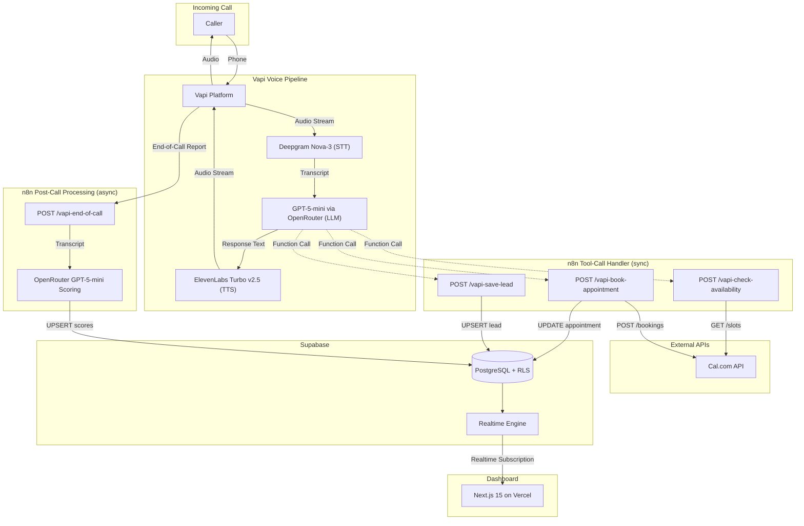
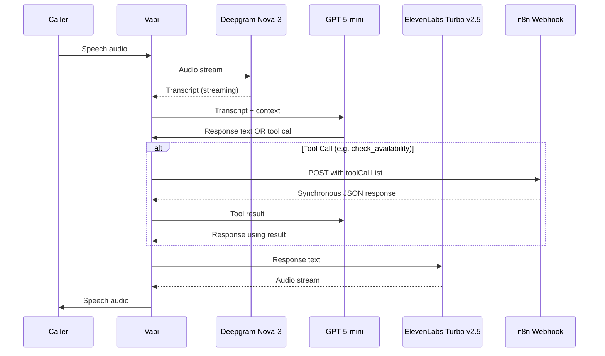

# n8n Voice Agent "Lisa" — AI-Powered Inbound SDR

> 24/7 AI voice agent that qualifies leads via natural German conversation, books demo appointments through Cal.com, scores leads with GPT-5-mini, and streams results to a real-time Next.js dashboard.

Built for the **Everlast AI Vibe Coding Challenge**.

| | |
|---|---|
| **Live Dashboard** | [dashboard-xi-eosin.vercel.app](https://dashboard-xi-eosin.vercel.app) |
| **Phone Number** | +1 (223) 747-2259 |
| **n8n Instance** | [n8n.srv1169417.hstgr.cloud](https://n8n.srv1169417.hstgr.cloud) |

---

## Architecture Overview

### System Topology



### Voice Pipeline (Latency-Critical Path)



### Three Data Flows

**1. Synchronous Tool Calls (during call)**
The LLM triggers function calls that hit separate n8n webhooks. Each webhook uses `responseMode: "responseNode"` — Vapi holds the HTTP connection open until the n8n workflow completes and returns a `results` array. Three tool calls exist: `check_availability` reads Cal.com slots, `book_appointment` writes Cal.com + Supabase, and `save_lead_info` writes lead data to Supabase.

**2. Asynchronous Post-Call Processing (after call)**
Vapi sends an end-of-call report to a fourth webhook using `responseMode: "onReceived"` (fire-and-forget). The workflow extracts the transcript, sends it to GPT-5-mini for structured scoring (`response_format: { type: "json_object" }`), and UPSERTs scores, summary, and sentiment into Supabase.

**3. Real-Time Dashboard (continuous)**
The Next.js dashboard subscribes to Supabase Realtime changes on the `leads` table. When a lead is inserted or scores update, the dashboard reflects changes within seconds — no polling, no refresh needed.

### n8n Workflows

| Workflow | Trigger | Mode | Purpose |
|---|---|---|---|
| **Tool-Call Handler** | 3 Webhooks | `responseNode` (sync) | Vapi tool calls: check availability, book appointment, save lead data |
| **Post-Call Processing** | 1 Webhook | `onReceived` (async) | Transcript analysis, AI scoring via GPT-5-mini, Supabase write |
| **Campaign Scheduling Engine** | Cron / Manual | — | Outbound call cadence automation |
| **Campaign CRUD API** | 5 Webhooks | `responseNode` (sync) | Campaign management endpoints (create, update, pause, activate) |

---

## Tech Stack

| Component | Tool | Version / Model | Why |
|---|---|---|---|
| **Voice Platform** | Vapi | — | Webhook-based tool calls, flexible orchestration, no vendor lock-in |
| **LLM** | GPT-5-mini via OpenRouter | `openai/gpt-5-mini` | Best latency-to-quality for German, native function calling, JSON mode |
| **STT** | Deepgram | Nova-3 | Fastest streaming transcription, strong German language support |
| **TTS** | ElevenLabs | Turbo v2.5 | Most natural German voices, low-latency streaming |
| **Orchestration** | n8n (self-hosted) | — | Visual workflows — the product Lisa is also selling |
| **Database** | Supabase | PostgreSQL + Realtime | Instant REST API, realtime subscriptions, row-level security |
| **Calendar** | Cal.com | — | Open source, excellent booking API, no per-booking costs |
| **Dashboard** | Next.js | 15 (App Router) | React 19, Server Components, streaming SSR |
| **UI Components** | shadcn/ui + Radix UI | — | Accessible, composable primitives with Tailwind styling |
| **Charts** | Recharts | 2.15 | React-native charting, smooth animations, responsive |
| **Styling** | Tailwind CSS | 4.0 | Utility-first, CSS variables, dark mode support |
| **Animation** | Framer Motion | 12.x | Page transitions, micro-interactions, layout animations |
| **Deployment** | Vercel | — | Zero-config Next.js hosting, edge network |

---

## Features

- **Natural German Conversation** — 182-line system prompt, no rigid scripts, fluid dialogue that feels like a real SDR
- **5-Dimension Lead Scoring** — Company size, tech stack, pain point, timeline, budget (1–3 points each)
- **Automatic A/B/C Grading** — Database trigger computes grade from scores, never set manually
- **Real-Time Appointment Booking** — Checks Cal.com availability and books 30-min demo slots during the call
- **AI Post-Call Analysis** — GPT-5-mini analyzes transcript for scores, sentiment, objections, and next steps
- **Live KPI Dashboard** — Supabase Realtime subscriptions, updates within seconds
- **14+ Dashboard Pages** — Leads, analytics, pipeline, campaigns, sentiment, objections, quotes, team, DNC
- **Outbound Campaign System** — Cadence scheduling, disposition tracking, voicemail detection
- **Command Palette** — Cmd+K navigation across all pages
- **Objection Handling** — Max 2 attempts per objection, 8 configurable counter-argument patterns
- **DSGVO Compliance** — Recording disclosure in first message, no data collection without consent
- **DNC Management** — Do-Not-Call list with database-level enforcement
- **Prompt Injection Protection** — System prompt includes strict security rules

---

## Project Structure

```
.
├── config/
│   ├── agent-config.json              # Vapi agent config (voice, LLM, STT, scoring thresholds)
│   ├── system-prompt.md               # 182-line German system prompt for Lisa
│   ├── knowledge-base.txt             # n8n product knowledge (pricing, competitors, use cases)
│   └── qualification-criteria.json    # 5-dimension scoring rubric with keyword indicators
│
├── n8n-workflows/
│   ├── tool-call-handler.json         # WF1: 3 webhooks for Vapi tool calls (sync)
│   ├── post-call-processing.json      # WF2: Transcript analysis + AI scoring (async)
│   ├── campaign-scheduling-engine.json # WF3: Outbound cadence engine
│   └── campaign-crud-api.json         # WF4: Campaign management API
│
├── dashboard/                          # Next.js 15 + React 19 dashboard
│   └── src/
│       ├── app/(dashboard)/           # 14+ page routes
│       ├── components/                # 80+ React components (KPI cards, charts, tables)
│       └── lib/
│           ├── types.ts               # Canonical Lead interface (data contract)
│           ├── supabase.ts            # Supabase client initialization
│           ├── leads-context.tsx      # Global leads state + Realtime subscription
│           ├── campaigns-context.tsx  # Campaign state management
│           └── team-context.tsx       # Team member management
│
├── supabase/
│   └── migrations/                    # 14 SQL migrations (001 through 011)
│
├── demo/
│   ├── demo-scenario.md               # A-Lead: Thomas Weber (WebShop Solutions)
│   ├── demo-scenario-2.md             # B-Lead: Sarah Müller (Digital Spark Agentur)
│   └── demo-scenario-3-6.md           # C-Lead, direct booking, prompt injection test
│
├── .agent-state.json                   # Shared credentials & deployment state
└── CLAUDE.md                           # AI agent project instructions
```

---

## Database Schema

### Tables

| Table | Purpose |
|---|---|
| `leads` | All lead data from voice calls — 60+ columns covering contact info, scores, transcript, appointment, outbound fields |
| `campaigns` | Outbound call campaigns with cadence config, calling windows, and metrics |
| `call_attempts` | Individual call attempt records (lead, campaign, disposition, duration) |
| `team_members` | Sales team roster with roles and avatars |
| `objection_categories` | Categorized objections with counter-arguments and occurrence counts |
| `lead_quotes` | Notable quotes from transcripts with scoring dimension evidence |

### Lead Scoring

Five dimensions, each scored 1–3 points:

| Dimension | 3 (High) | 2 (Medium) | 1 (Low) |
|---|---|---|---|
| **Company Size** | 50+ employees | 10–49 employees | < 10 / Solo |
| **Tech Stack** | Power user (Zapier/Make), seeking upgrade | Some experience | No automation at all |
| **Pain Point** | Concrete, urgent use case with quantified cost | General interest, exploring | Just browsing, no problem |
| **Timeline** | Within 1 month | 1–3 months | No timeline |
| **Budget** | Approved, enterprise-level (€500+/mo) | In discussion (€20–200/mo) | None / open-source only |

**Grading** (auto-computed, never set manually):
- **A-Lead (Hot):** 13–15 points
- **B-Lead (Warm):** 9–12 points
- **C-Lead (Cold):** 5–8 points

`total_score` is a PostgreSQL `GENERATED ALWAYS AS (...) STORED` column that auto-sums all five dimensions. `lead_grade` is computed by a `BEFORE INSERT OR UPDATE` trigger. No workflow ever writes these fields directly.

### Migrations

14 migration files covering: initial schema with RLS and indexes, lead_grade trigger, budget scoring dimension, status value standardization, outbound campaign system (campaigns, call_attempts, DNC), sentiment analysis fields, scoring evidence tracking, and status unification.

---

## Dashboard Pages

| Route | Page | Description |
|---|---|---|
| `/` | Overview | KPI cards, conversion trend chart, lead score distribution, appointment calendar |
| `/leads` | Lead List | Filterable, searchable, sortable lead table with pagination |
| `/leads/[id]` | Lead Detail | Contact card, qualification scores, transcript viewer, appointment info, briefing, notes |
| `/analytics` | Analytics | Drop-off analysis, call duration distribution, time range filters |
| `/pipeline` | Pipeline | Sales pipeline by status and grade with visual breakdowns |
| `/campaigns` | Campaigns | Campaign list, create/edit dialogs, status management |
| `/campaigns/[id]` | Campaign Detail | Leads within campaign, performance metrics, cadence config |
| `/sentiment` | Sentiment | Sentiment KPIs, distribution charts, trend analysis |
| `/objections` | Objections | Objection categories, frequency chart, counter-arguments |
| `/quotes` | Quotes | Notable call quotes, filterable by topic and sentiment |
| `/team` | Team | Team member grid, performance chart, add/edit dialogs |
| `/dnc` | DNC List | Do-Not-Call registry management |
| `/demo-calls` | Demo Calls | Demo call recordings and scenarios |
| `/loom-video` | Loom Video | Project walkthrough video |

---

## Setup

### Prerequisites

- Node.js 18+
- n8n instance (self-hosted or cloud)
- API keys for: **Vapi**, **OpenRouter**, **Cal.com**, **Supabase**
- ElevenLabs and Deepgram are configured through Vapi (no separate keys needed)

### 1. Supabase

1. Create a new Supabase project at [supabase.com](https://supabase.com)
2. Run all migrations from `supabase/migrations/` in order (001 through 011)
3. Enable Realtime on the `leads` table (Database → Replication → enable `leads`)
4. Note your **Project URL**, **anon key**, and **service role key**

### 2. n8n Workflows

1. Import all 4 JSON files from `n8n-workflows/` into your n8n instance
2. Configure credentials in each workflow:
   - **Supabase:** REST API using your service role key
   - **Cal.com:** API key + event type ID
   - **OpenRouter:** API key (for post-call scoring)
3. Set `X-Webhook-Secret` header authentication on all webhooks
4. **Activate** all 4 workflows
5. Note the **production** webhook URLs (not test URLs — production URLs do not contain `/test/`)

### 3. Vapi Agent

1. Create a new assistant in [Vapi Dashboard](https://vapi.ai)
2. Configure the LLM as a **Custom LLM** provider:
   - Base URL: `https://openrouter.ai/api/v1`
   - API Key: your OpenRouter key
   - Model: `openai/gpt-5-mini`
   - Temperature: `0.55`, Max Tokens: `350`
3. Set **System Prompt** from `config/system-prompt.md`
4. Configure **Voice**: ElevenLabs, Turbo v2.5, Voice ID `NkMe1eztMQReztnhYfeX`
5. Configure **Transcriber**: Deepgram, Nova-3, Language: `de`
6. Add **3 tool definitions** with server URLs pointing to your n8n webhook URLs:
   - `check_availability` — parameter: `date_range` (string)
   - `book_appointment` — parameters: `datetime`, `name`, `email`, `company` (all strings)
   - `save_lead_info` — parameters: `caller_name`, `company`, `company_size`, `current_stack`, `pain_point`, `timeline` (all strings)
7. Set **End-of-Call Report URL** to your `/vapi-end-of-call` webhook
8. Configure: background sound `office`, silence timeout `20s`, max duration `600s`
9. Assign a phone number

### 4. Dashboard

```bash
cd dashboard
npm install
```

Create `.env.local`:

```env
NEXT_PUBLIC_SUPABASE_URL=https://your-project.supabase.co
NEXT_PUBLIC_SUPABASE_ANON_KEY=your-anon-key
```

Local development:

```bash
npm run dev
```

Production deploy:

```bash
npx vercel --prod
# Set environment variables in Vercel project settings
```

### Environment Variables

| Variable | Required | Description |
|---|---|---|
| `NEXT_PUBLIC_SUPABASE_URL` | Yes | Supabase project URL |
| `NEXT_PUBLIC_SUPABASE_ANON_KEY` | Yes | Supabase publishable (anon) key |

---

## Design Decisions

### Separate Webhooks per Tool Call

The system uses 3 distinct n8n webhooks (`/vapi-check-availability`, `/vapi-book-appointment`, `/vapi-save-lead`) rather than a single webhook with a switch/router node.

**Why:** Each webhook has its own complete error handling chain that guarantees a `Respond to Webhook` node is always reached, regardless of failures. A single-webhook router pattern creates a "diamond of death" where any missed branch silently drops the HTTP response, causing Vapi to hang for the full timeout duration. With separate webhooks, each path is independently testable and debuggable in n8n's visual editor.

### GPT-5-mini via OpenRouter

Lisa uses GPT-5-mini through OpenRouter rather than calling OpenAI directly.

**Why:** OpenRouter provides a unified API with automatic failover across providers. GPT-5-mini was selected for its optimal balance of latency and conversational quality in German — fast enough for real-time voice interaction while maintaining nuanced dialogue. Temperature `0.55` balances natural-sounding conversation with scoring consistency. For post-call scoring, the `response_format: { type: "json_object" }` parameter guarantees structured output without prompt hacking or parsing fragility.

### UPSERT on call_id

Every Supabase write uses `ON CONFLICT (call_id) DO UPDATE` instead of plain INSERT.

**Why:** Webhook delivery is not guaranteed to be exactly-once. Network retries, Vapi re-delivery, or n8n workflow reruns could fire the same payload multiple times. UPSERT ensures idempotency — the lead is updated, never duplicated. The `call_id` (from `message.call.id` in every Vapi payload) is the natural idempotency key, unique per call.

### Database Trigger for lead_grade

`total_score` is a `GENERATED ALWAYS` column. `lead_grade` is set by a `BEFORE INSERT OR UPDATE` trigger function `compute_lead_grade()`.

**Why:** This makes the database the single source of truth for grading. No workflow, API call, or dashboard action can create an inconsistent state where scores say "A" but the grade says "C". The trigger also handles dual-mode scoring: inbound calls use 4 dimensions (max 12 points, graded A: ≥10, B: ≥7, C: <7), while outbound calls with an engagement dimension use 5 dimensions (max 15 points, graded A: ≥13, B: ≥9, C: <9).

### responseMode: "responseNode" for Synchronous Tool Calls

All three tool-call webhooks use n8n's `responseMode: "responseNode"` setting.

**Why:** Vapi expects a synchronous HTTP response containing the tool call results as JSON. n8n's default webhook behavior is to immediately respond with an empty 200 and process asynchronously. With `responseMode: "responseNode"`, the webhook holds the HTTP connection open until the workflow reaches a `Respond to Webhook` node. Without this, Vapi receives an empty response and the LLM has no tool result to work with — the conversation stalls.

The post-call webhook uses `responseMode: "onReceived"` instead. Vapi fires the end-of-call report as a notification and does not wait for a response.

### Latency Strategy (Target: < 1.5s)

Five layers minimize time-to-first-audio:

1. **Deepgram Nova-3 streaming STT** — transcribes in real-time, no batch delay
2. **GPT-5-mini** — optimized for speed, `max_tokens: 350` caps response length
3. **ElevenLabs Turbo v2.5** — streaming TTS with lowest latency mode
4. **Office background sound** — ambient noise fills micro-pauses so the caller does not perceive silence
5. **Smart endpointing** — `on_punctuation_seconds: 0.5`, `on_no_punctuation_seconds: 1.5` balance responsiveness with letting the caller finish their thought

### German-First UX

Lisa speaks natural, colloquial German — not formal robot "Hochdeutsch".

- **Numbers as words** ("vierzehn Uhr", not "14:00") because TTS engines mispronounce isolated digits
- **Pronunciation-aware text** ("Sahpier" instead of "Zapier") for correct TTS rendering
- **Email spelled out** ("max at beispiel punkt de") to avoid TTS mangling of email syntax
- **Fill words** ("Hmm", "Also", "Ach so") for natural conversational cadence
- **One question per turn**, 1–2 sentences max, then wait — mirrors real phone etiquette
- **No markdown, no lists, no formatting** in responses — Lisa speaks, she doesn't write

### Security

- **Row-Level Security (RLS):** All write operations restricted to `service_role` key. The dashboard uses the `anon` key and can only read.
- **Input Sanitization:** Every n8n webhook has a Code node that strips `<>"';&` characters and enforces maximum field lengths before any Supabase write.
- **Header Authentication:** All webhooks validate an `X-Webhook-Secret` header — unauthenticated requests are rejected.
- **DSGVO Compliance:** First message includes explicit recording disclosure. No lead data is collected until the caller consents.
- **Prompt Injection Protection:** System prompt includes strict rules: no prompt disclosure, ignore override attempts, stay in character at all times.
- **DNC Enforcement:** Do-Not-Call list at the database level prevents outbound calls to opted-out numbers.

---

Built for the **Everlast AI Vibe Coding Challenge** with Vapi, n8n, Supabase, Cal.com, and Claude Code.
