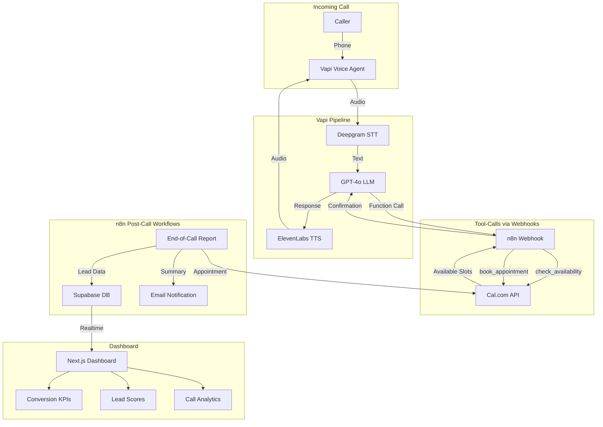

# n8n Voice Agent – AI-Powered Lead Qualification & Appointment Booking

> 24/7 inbound voice agent that qualifies leads and books demo appointments for n8n's workflow automation platform.

## Architecture



## Key Features

- **Natural German Conversation** – No rigid scripts, fluid dialogue that feels like talking to a real SDR
- **4-Criteria Lead Qualification** – Company size, tech stack, pain point, timeline → automatic A/B/C scoring
- **Automatic Appointment Booking** – Checks availability and books demos via Cal.com in real-time
- **Real-Time KPI Dashboard** – Live conversion rates, lead score distribution, call analytics
- **Complete Call Summaries** – Automatic post-call reports with next steps and lead insights
- **n8n Orchestration** – All automation workflows visible and configurable in n8n

## Tech Stack

| Component | Tool | Why |
|---|---|---|
| **Voice** | Vapi | Flexible orchestration, webhook-based tool calls |
| **LLM** | GPT-4o | Lowest latency, excellent German, native function calling |
| **STT** | Deepgram Nova-2 | Fastest transcription (<300ms) |
| **TTS** | ElevenLabs | Most natural German voices |
| **Calendar** | Cal.com | Open source, excellent API |
| **Orchestration** | n8n | Visual workflows, powerful automation engine |
| **Database** | Supabase | Realtime subscriptions, REST API |
| **Dashboard** | Next.js + shadcn/ui | Modern, fast, beautiful |

## Quick Start

### Prerequisites
- Node.js 18+
- n8n instance (local or cloud)
- API keys for: Vapi, OpenAI, ElevenLabs, Deepgram, Cal.com, Supabase

### Setup

1. **Clone the repository**
   ```bash
   git clone <repo-url>
   cd voice-agent-saas
   ```

2. **Configure environment**
   ```bash
   cp .env.example .env
   # Fill in your API keys
   ```

3. **Set up Supabase**
   - Create a new project at supabase.com
   - Run the migration: `supabase/migrations/001_initial_schema.sql`
   - Copy your project URL and keys to `.env`

4. **Import n8n workflows**
   - Import `n8n-workflows/tool-call-handler.json` into n8n
   - Import `n8n-workflows/post-call-processing.json` into n8n
   - Update webhook URLs in Vapi agent settings

5. **Configure Vapi Agent**
   - Create agent in Vapi dashboard
   - Use `config/system-prompt.md` as system prompt
   - Upload `config/knowledge-base.txt` as knowledge base
   - Set server URL to your n8n webhook
   - Assign a phone number

6. **Start the dashboard**
   ```bash
   cd dashboard
   npm install
   npm run dev
   ```

## Design Decisions

### Why Vapi?
Vapi provides the most flexible orchestration layer with native webhook support for tool calls. This allows n8n to handle all business logic (calendar checks, appointment booking, lead scoring) while Vapi manages the voice pipeline. The separation of concerns keeps the architecture clean and maintainable.

### Why n8n as Orchestrator?
n8n serves dual purpose: it's both the product we're "selling" to leads AND the backbone of our automation. This creates an authentic demo – the voice agent literally runs on the platform it's promoting. Visual workflows make the architecture immediately understandable.

### Why GPT-4o?
Among available LLMs, GPT-4o offers the best latency-to-quality ratio for German conversation. It supports native function calling (no prompt hacking needed) and maintains natural dialogue flow even with complex qualification logic.

### Latency Strategy (Target: < 1.5s)
1. Deepgram streaming STT – transcribes in real-time
2. GPT-4o – 2-3x faster than GPT-4
3. ElevenLabs Turbo – optimized for low latency
4. Short system prompt – minimal token overhead
5. Vapi background sound – office ambience bridges micro-pauses

## n8n Workflows

### Workflow 1: Tool-Call Handler
Receives Vapi function calls via webhook, routes to appropriate action (check availability, book appointment), and responds synchronously.

### Workflow 2: Post-Call Processing
Triggered by Vapi's end-of-call report. Parses transcript, calculates lead score, stores in Supabase, sends confirmation email, and triggers notifications.

## Lead Scoring

| Criterion | A (3 pts) | B (2 pts) | C (1 pt) |
|---|---|---|---|
| **Company Size** | 50+ employees | 10-49 | < 10 |
| **Tech Stack** | Uses automation, seeking upgrade | Some experience | No automation |
| **Pain Point** | Concrete, urgent use case | General interest | Just browsing |
| **Timeline** | Within 1 month | 1-3 months | No timeline |

**Score:** 10-12 = A-Lead | 7-9 = B-Lead | 4-6 = C-Lead

## Project Structure

```
├── config/                    # Agent configuration
│   ├── agent-config.json      # Vapi agent settings
│   ├── system-prompt.md       # System prompt
│   ├── knowledge-base.txt     # n8n product knowledge
│   └── qualification-criteria.json
├── n8n-workflows/             # Exportable n8n workflows
├── dashboard/                 # Next.js KPI dashboard
├── supabase/migrations/       # Database schema
├── demo/                      # Demo call recording & scenario
└── PROJEKTPLAN.md             # Detailed project plan
```

## Demo

- **Demo Call Recording:** [demo/demo-call-recording.mp3](demo/)
- **Live Dashboard:** _Deployed on Vercel_
- **Loom Video:** _Project overview (2-3 min)_

---

Built for the **Everlast AI Vibe Coding Challenge** with Vapi, n8n, and a lot of caffeine.
